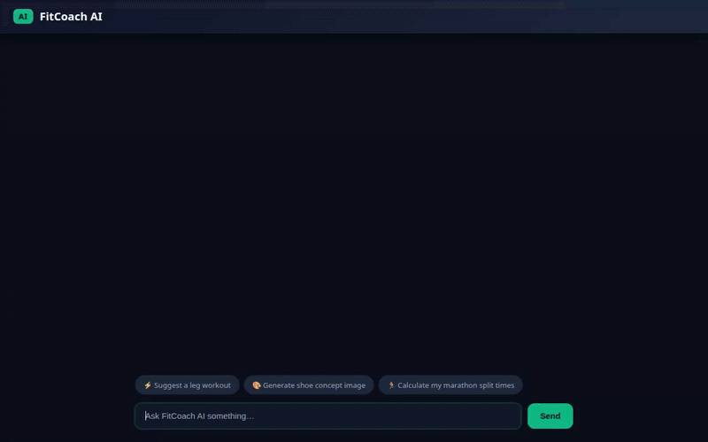

# FitCoach AI — Intelligent Personal Fitness & Gear Agent



**FitCoach AI** is an agentic AI assistant built with Google's **Agent Development Kit (ADK)** and deployed on **Vertex AI Agent Engine (Agent Runtime)**. It delivers personalized fitness plans, tracks workout routines and equipment usage, generates visual concept graphics and video demonstrations, computes training split metrics, and locates nearby athletic facilities.

---

## Key Capabilities & Architecture

### 1. Cross-Session Memory Persistence
- **Vertex AI Memory Bank Integration**: Utilizes `VertexAiMemoryBankService` and `PreloadMemoryTool` to automatically recall user fitness goals, training preferences, and health limitations across sessions.
- **Session Memory Callback**: Automatically ingests session events into Memory Bank at the end of each turn.

### 2. Workout & Gear Tracking (Firestore)
- **Workout Logging & Retrieval**: Reads and writes workout routines (`log_workout`, `get_workouts`) to Google Cloud Firestore (`qwiklabs-gcp-02-9f748384db25`).
- **Gear Management**: Tracks equipment usage, mileage on running shoes, and fitness gear condition (`log_gear`, `get_gear`).

### 3. Visual & Video Generation
- **Google Imagen 3 Concept Art**: Generates visual gear concepts and workout graphics using `imagen-3.0-generate-002` in `us-central1`.
- **Google Omni Video Generation**: Generates 5-second exercise demonstration clips using `gemini-omni-flash-preview` in region `global`.
- **Cloud Storage Hosting**: Saves media as session artifacts and uploads files directly to a public Cloud Storage bucket (`fitcoach-ai-media-9f748384`).

### 4. Location & Training Intelligence
- **Google Maps Geocoding & Places**: Locates nearby gyms, running tracks, and fitness centers (`geocode_address`, `find_nearby_places`) via Google Maps API.
- **Exercise Database Tool**: Looks up exercise instructions, targeted muscle groups, and required equipment (`search_exercise_database`).
- **Training Metrics Calculator**: Computes target marathon split times, race pace predictions, and heart rate training zones (`calculate_training_metrics`).

### 5. Secure Code Execution & UI Rendering
- **Agent Engine Sandbox**: Executes Python calculations in a secure Cloud Run sandbox environment (`AgentEngineSandboxCodeExecutor`).
- **A2UI v0.8 Dynamic Cards**: Emits structured A2UI cards rendered natively in both local dev UI and production chat frontend.

---

## Repository Structure

```
fitcoach-ai/
├── app/
│   ├── agent.py               # Core ADK agent configuration & tool registry
│   ├── a2ui_utils.py          # A2UI card renderer & system prompt manager
│   ├── firestore_tools.py     # Firestore workout & gear tracking tools
│   ├── image_tools.py         # Imagen 3 image generation & GCS upload tool
│   ├── video_tools.py         # Gemini Omni video generation & GCS upload tool
│   ├── maps_tools.py          # Google Maps geocoding & nearby places tools
│   ├── exercise_db_tools.py   # Public exercise database lookup tool
│   ├── training_tools.py      # Marathon split & HR zone calculation tools
│   └── fast_api_app.py        # A2A protocol endpoint wrapper
├── frontend/
│   ├── main.py                # FastAPI proxy server (A2A protocol -> Agent Engine)
│   └── static/
│       └── index.html         # Custom dark athletic chat interface with A2UI renderer
├── agents-cli-manifest.yaml   # Agent Platform deployment manifest
└── agent_demo.gif             # Inline demo animation
```

---

## Local Development & Setup

### Prerequisites

- Python 3.10+
- `uv` package manager installed
- Google Cloud SDK (`gcloud`) authenticated to your GCP Project

### Environment Variables

Create a `.env` file in the root directory:

```bash
GOOGLE_GENAI_USE_VERTEXAI=true
GOOGLE_CLOUD_PROJECT=your-gcp-project-id
GOOGLE_CLOUD_LOCATION=us-central1
GOOGLE_MAPS_API_KEY=your-google-maps-api-key
```

### Running Locally

1. **Install Dependencies**:
   ```bash
   uv sync
   ```

2. **Start the Agent Playground (ADK Web)**:
   ```bash
   uv run adk web . --port 8080 --reload_agents --memory_service_uri=agentengine://<YOUR_MEMORY_BANK_ID>
   ```

3. **Start the Custom Frontend (FastAPI Proxy)**:
   ```bash
   cd frontend
   AGENT_ENGINE_RESOURCE_NAME="projects/<PROJECT_ID>/locations/us-central1/reasoningEngines/<ENGINE_ID>" \
   AGENT_DIRECTORY="app" \
   PORT=8080 \
   uv run python main.py
   ```

---

## Deployment Instructions

### 1. Deploy Agent to Vertex AI Agent Engine

```bash
agents-cli deploy \
  --project <PROJECT_ID> \
  --region us-central1 \
  --update-env-vars GOOGLE_MAPS_API_KEY=<MAPS_KEY> \
  --no-confirm-project
```

### 2. Deploy Frontend to Cloud Run

```bash
gcloud run deploy fitcoach-ai-frontend \
  --source=./frontend \
  --project=<PROJECT_ID> \
  --region=us-central1 \
  --set-env-vars=AGENT_ENGINE_RESOURCE_NAME=projects/<PROJECT_ID>/locations/us-central1/reasoningEngines/<ENGINE_ID>,AGENT_DIRECTORY=app \
  --allow-unauthenticated
```
